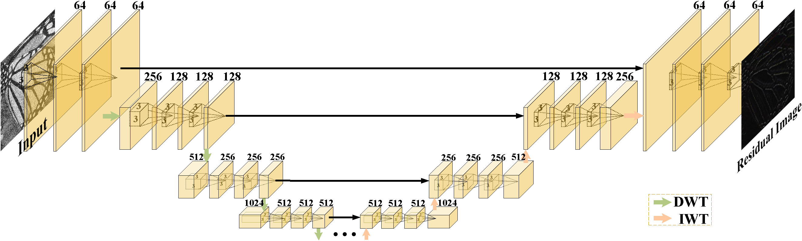
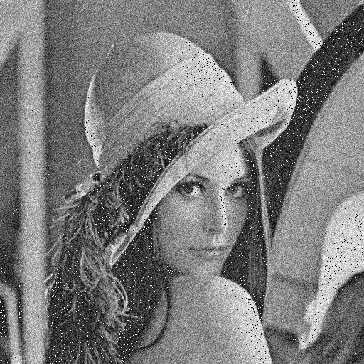

## README

Code Replication of Multi-level Wavelet Convolutional Neural Networks using Pytorch 

paper: https://arxiv.org/abs/1805.07071

source code: https://github.com/lpj-github-io/MWCNNv2/tree/master



### File Directory

- data_gen                                  --store code files to generate dataset
- images                                     --store images from README.md
- MWCNN_code
  - data                                    --store dataset
    - Set12
  - experiment           
    - MWCNN_Denoising
      - results                  --store the results for image denoising
  - loss                                    --store the files of definition of the loss function
  - model                               --store model initialization files
  - pretrain_model               --store pre-trained models 
    - denoising
- requirements.txt
- README.md

### Dependencies

```
Python==3.7
torch==1.0.0
numpy
scikit-image
imageio
matplotlib
tqdm
h5py
scipy==1.2.0
torchvision==0.2.2
```

- run

```shell
pip install -r requirements.txt
```


### Test

#### Image denoising

- Pretraining model can be found [here](https://drive.google.com/drive/folders/1H8XD1MrS1bEGY5RAjPI0IiZVLADh1JRT?usp=sharing)

- Download the pretraining model and put it under `MWCNNv2-master/MWCNN_code/pretrain_model/denoising`

- Run the following command:

- ```shell
  python main.py --model MWCNN --save MWCNN_DeNoising --scale 25 --n_feats 64 --save_results --print_model --n_colors 1 --test_only --resume -1 --pre_train pretrain_model/denoising/ --data_test Set12 --task_type denoising --dir_data data
  ```

### Results

Results can be found in `MWCNNv2-master/MWCNN_code/experiment/MWCNN_Denoising/results`

<center>
  
  
  
</center>

<center>
    Fig&nbsp;1.x25_HR&nbsp;&nbsp;&nbsp;&nbsp;&nbsp;&nbsp;&nbsp;&nbsp;&nbsp;&nbsp;&nbsp;&nbsp;&nbsp;&nbsp;&nbsp;&nbsp;&nbsp;&nbsp;&nbsp;&nbsp;&nbsp;&nbsp;&nbsp;&nbsp;&nbsp;&nbsp;&nbsp;&nbsp;&nbsp;&nbsp;Fig&nbsp;2.x25_LR&nbsp;&nbsp;&nbsp;&nbsp;&nbsp;&nbsp;&nbsp;&nbsp;&nbsp;&nbsp;&nbsp;&nbsp;&nbsp;&nbsp;&nbsp;&nbsp;&nbsp;&nbsp;&nbsp;&nbsp;&nbsp;&nbsp;&nbsp;&nbsp;&nbsp;&nbsp;&nbsp;&nbsp;&nbsp;&nbsp;Fig&nbsp;3.x25_SR
</center>


### Reference

- Liu, Pengju, et al. "Multi-Level Wavelet Convolutional Neural Networks." IEEE Access 7 (2019): 74973-74985.
  
  [Link to Paper](https://ieeexplore.ieee.org/document/8774182)
  
  ```
  @article{Liu2019MWCNN,
    title={Multi-Level Wavelet Convolutional Neural Networks},
    author={Liu, Pengju and Zhang, Hongzhi and Lian Wei and Zuo, Wangmeng},
    journal={IEEE Access},
    volume={7},
    pages={74973-74985},
    year={2019},
    publisher={IEEE}
  }
  ```
  
- Liu, Pengju, et al. "Multi-Level Wavelet-CNN for Image Restoration." In The IEEE Conference on Computer Vision and Pattern Recognition (CVPR) Workshops, June 2018.
  
  [Link to Paper](http://openaccess.thecvf.com/content_cvpr_2018_workshops/papers/w13/Liu_Multi-Level_Wavelet-CNN_for_CVPR_2018_paper.pdf)
  
  ```
  @InProceedings{Liu_2018_CVPR_Workshops,
    author = {Liu, Pengju and Zhang, Hongzhi and Zhang, Kai and Lin, Liang and Zuo, Wangmeng},
    title = {Multi-Level Wavelet-CNN for Image Restoration},
    booktitle = {The IEEE Conference on Computer Vision and Pattern Recognition (CVPR) Workshops},
    month = {June},
    year = {2018}
  }
  ```


