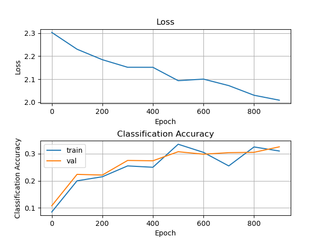

## README

### key algorithm

Implement of `Class SoftmaxClassifier`

```py
def __init__(self) # 初始化方法
def train_vec(self, X, y, learning_rate=1e-3, reg=1e-5, num_iterations=100,
                  batch_size=200, verbose=False) # 使用softmax_loss_vectorized的训练方法
def train_naive(self, X, y, learning_rate=1e-3, reg=1e-5, num_iterations=100,
                    batch_size=200, verbose=False) # 使用softmax_loss_naive的训练方法
def softmax_loss_naive(self, X, y, reg) # 注释见实验报告 
def softmax_loss_vectorized(self, X, y, reg) # 注释见实验报告
```


### Dependencies

```
matplotlib == 3.7.1
keras == 2.12.0
numpy == 1.23.2
tqdm == 4.65.0
```

run the following command

```shell
pip install -r requirements.txt
```


### Run

```shell
python softmax.py
```


### Results

During the training process, the progress of the training will be displayed and the value of the loss will be output 1 time per 100 iterations. The accuracy of the training set and the  validation set as well as the running time are also outputted.

<center>
  
  
</center>

It also outputs a visualization of the resultant graphs

<center>
  
  
</center>


